[github](https://github.com/VIBHUKATYAL)

> Pre-final year B.Tech student in Computer Science and Engineering at ABES Engineering College. 
> Small, sharp tools over big vague ideas.

Currently focusing on AI agents and desktop automation. Building systems that interact with the computer as a true AI agent.

`python` &nbsp; `c++` &nbsp; `machine learning` &nbsp; `docker` &nbsp; `git` &nbsp; `linux`

**[TARS-Desktop-AI-Agent](https://github.com/VIBHUKATYAL/TARS-Desktop-AI-Agent)** &nbsp;·&nbsp; `python` 
A desktop AI agent which performs computer operations as a true AI agent.

**[Maya](https://github.com/VIBHUKATYAL/maya)** &nbsp;·&nbsp; `python` 
Personal AI Assistant built natively.

**[ASCII_PORTRAIT](https://github.com/VIBHUKATYAL/ASCII_PORTRAIT)** 
Self-generating ASCII GitHub profile repository.

